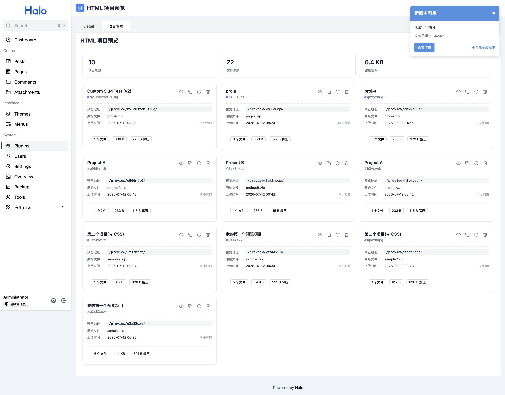
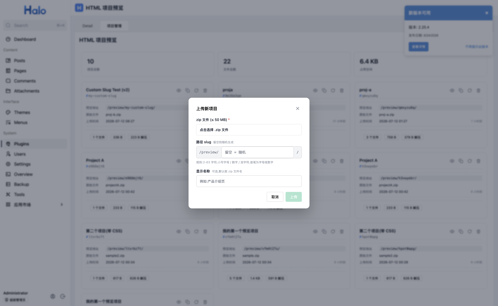
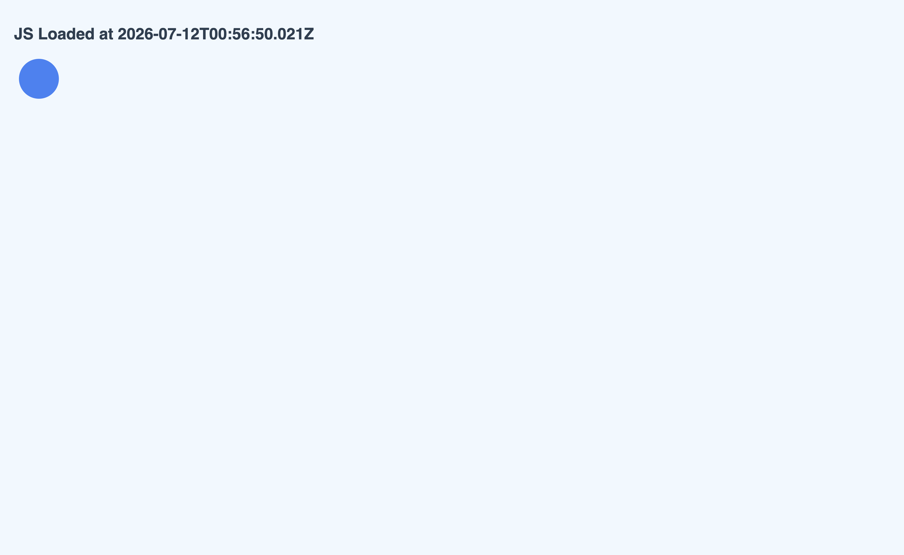
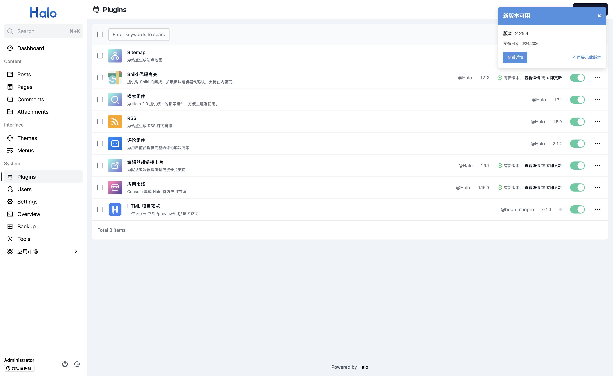
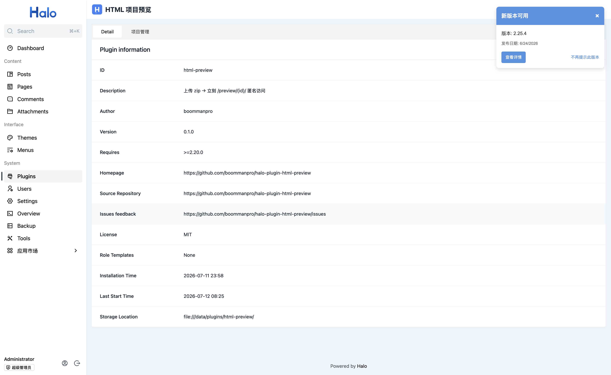

# halo-plugin-html-preview

一个 [Halo](https://halo.run) 插件:把 zip 打包的纯前端项目(HTML/CSS/JS/图片)一键发布为可公开访问的静态站点,访问路径形如 `/preview/{slug}/`。

## 截图

| 项目管理 | 上传对话框 |
|:---:|:---:|
|  |  |

| 预览站点 | 子页面 |
|:---:|:---:|
|  |  |

| 插件列表 | 插件详情 |
|:---:|:---:|
|  |  |

## 特性

- **zip 上传即发布**:管理后台上传 zip → 立即获得 `/preview/{slug}/` 公开访问链接
- **路径 slug 可自定义**:上传时可指定 slug(规则:`^[a-z0-9](?:[a-z0-9-]{0,61}[a-z0-9])?$`),不填则自动生成 8 位随机串
- **不可重复**:同名 slug 上传会被拒绝,需走"更新"接口
- **在线更新**:重新上传 zip 即可替换原项目,旧文件被清理,slug 保持不变,公开访问链接不失效
- **公开匿名访问**:预览路由不走鉴权,任何人都能访问 `/preview/{slug}/` 和 `/preview/{slug}/**`
- **安全防护**:zip 解压时逐 entry 校验(`..` / 绝对路径 / 反斜杠 / NUL 一律拒绝),单 entry ≤ 50 MB,文件数 ≤ 5000,解压总大小 ≤ 200 MB
- **卡片网格 UI**:项目管理页以响应式卡片网格呈现,含统计、预览、复制链接、更新、删除等操作

## 项目结构

```text
halo-plugin-html-preview/
├── src/main/java/run/halo/htmlpreview/
│   ├── HtmlPreviewPlugin.java         # 插件入口
│   ├── extension/HtmlProject.java    # Extension 模型(GVK: html-preview.halo.run/v1alpha1)
│   ├── endpoint/
│   │   ├── HtmlProjectEndpoint.java   # 管理 API(super-admin 限定)
│   │   └── PublicPreviewRouter.java   # 公开预览路由(匿名)
│   ├── service/
│   │   ├── HtmlProjectService.java    # 上传/更新/删除/列表
│   │   ├── ProjectStorage.java        # 磁盘存储根目录管理
│   │   ├── ZipExtractor.java          # 安全解压 + 统计
│   │   └── PathGuard.java             # 路径/zip entry 安全守卫
│   └── dto/ProjectVo.java             # API 返回模型
├── src/main/resources/
│   ├── plugin.yaml                    # 插件元数据
│   └── extensions/role-template-anonymous.yaml  # 匿名访问 role
├── ui/                                # Console 前端(Vue 3 + Vite)
│   ├── src/
│   │   ├── index.ts                   # 插件入口(definePlugin)
│   │   └── views/ProjectManagementTab.vue  # 项目管理标签页
│   ├── package.json
│   └── vite.config.ts
├── build.gradle                       # 依赖 + haloPlugin devtools 配置
├── gradle.properties
└── settings.gradle
```

## API

所有管理接口挂在前缀 `/apis/console.api.html-preview.halo.run/v1alpha1` 下,仅 super-admin 可访问。

| 方法 | 路径 | 说明 |
|---|---|---|
| `POST` | `/projects` | 上传新项目。multipart 字段:`file`(必填,zip)、`slug`(可选)、`displayName`(可选) |
| `GET` | `/projects` | 列出所有项目 |
| `GET` | `/projects/{name}` | 获取单个项目 |
| `PUT` | `/projects/{name}/replace` | 更新已存在项目的文件,multipart:`file`(必填)、`displayName`(可选)。slug 不变,旧文件被清理 |
| `DELETE` | `/projects/{name}` | 删除项目,磁盘文件一并清理 |

公开预览路由(匿名,不需要鉴权):

| 方法 | 路径 | 说明 |
|---|---|---|
| `GET` | `/preview/{slug}` | 重定向到 index.html |
| `GET` | `/preview/{slug}/` | 返回 index.html |
| `GET` | `/preview/{slug}/**` | 返回项目内任意静态文件 |

## 构建

需要 JDK 21+ 和 Node.js 22+(用于构建前端)。

```bash
./gradlew build -x test
```

产物:`build/libs/halo-plugin-html-preview-0.1.0.jar`

前端单独构建(已包含在 `./gradlew build` 中):

```bash
cd ui
pnpm install
pnpm run build     # 输出到 build/resources/main/console/{main.js,style.css}
```

## 本地开发

`build.gradle` 已配置 `run.halo.plugin.devtools` 0.6.2,使用 Docker 跑 Halo 2.25.0:

```bash
./gradlew haloServer    # 启动 Halo(默认端口 8090,管理员 admin/admin)
```

插件以 dev mode 加载,直接读取 `build/classes/java/main/` 和 `build/resources/main/`,修改 Java/前端后 `./gradlew build` 即可热加载。

## 配置项

通过 Halo 配置文件覆盖默认值:

| 配置 | 默认值 | 说明 |
|---|---|---|
| `halo.plugin.html-preview.storage-root` | `~/.halo2/html-projects` | 项目文件存储根目录 |

## 限制

- 单个 zip ≤ 50 MB
- 单个 zip entry ≤ 50 MB
- 项目内文件数 ≤ 5000
- 解压总大小 ≤ 200 MB
- zip 根目录必须包含 `index.html`

## 安装 / 升级 / 卸载

| 操作 | 行为 |
|---|---|
| 安装 | 注册 `HtmlProject` Extension、注册管理与预览路由,不影响已有数据 |
| 启用 | 路由生效,可上传/预览项目 |
| 禁用 | 路由失效,已上传项目保留在磁盘上但无法访问 |
| 卸载 | 删除 `HtmlProject` Extension 资源,**磁盘上的项目文件不会自动删除**(可手动清理 `~/.halo2/html-projects/`) |
| 升级 | 兼容已有 Extension 数据;若结构有破坏性变更,会在版本说明中显式提示 |

## 隐私说明

本插件**不收集任何用户数据**,不上报遥测、统计、崩溃信息,不连接任何第三方服务。

- 上传的 zip 包内容会解压并存放在 Halo 服务器本地磁盘 `~/.halo2/html-projects/{slug}/` 下
- 项目内容通过 `/preview/{slug}/` 路径公开访问,任何匿名访客均可读取
- 不要上传包含敏感信息(密码、密钥、个人隐私)的项目文件

## 第三方服务

本插件不依赖任何第三方服务,所有功能均在 Halo 服务器本地完成。

## 技术栈

- Halo SDK 2.25.0
- Java 21 + Spring WebFlux
- Vue 3 + Vite 5 + `@halo-dev/ui-plugin-bundler-kit`
- Lombok

## License

MIT
